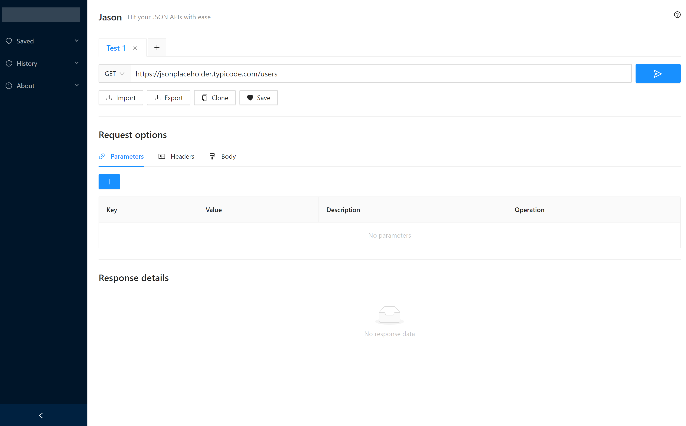

# Jason

An Electron based desktop application for sending HTTP requests. (WIP)

## Installation

Install the node modules:

`npm install`

Start React: (close the browser window that pops up)

`npm start`

Start the Electron process:

`npm run electron`

